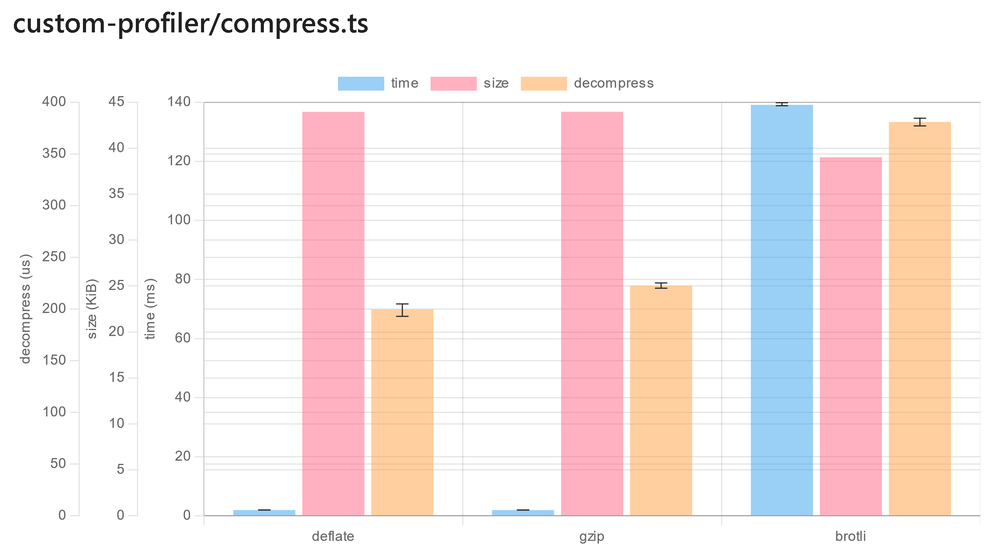

# Custom Profilers

ESBench only has built-in support for measuring function execution time, but the term benchmarking isn't the only one, the size of the returned value or other metrics may also be something we want to know.

For that, ESBench allow to add custom profilers to suite, whose measured metrics will be displayed in the report. A `Profiler` is a series of hooks that are called at specific times in the run suite:

```typescript
export interface Profiler {
	/**
	 * Called on each `ProfilingContext.run` (`runSuite` invokes it once).
	 * This is the recommended hook to add descriptions of metrics.
	 */
	onStart?: (ctx: ProfilingContext) => Awaitable<void>;

	/**
	 * Called on each scene (after `setup` of the suite).
	 */
	onScene?: (ctx: ProfilingContext, scene: Scene) => Awaitable<void>;

	/**
	 * Called for each case. In there you can add metrics as properties to `metrics`.
	 */
	onCase?: (ctx: ProfilingContext, case_: BenchCase, metrics: Metrics) => Awaitable<void>;

	/**
	 * Called at the end of `ProfilingContext.run`.
	 */
	onFinish?: (ctx: ProfilingContext) => Awaitable<void>;
}
```

## Buffer Size

Let's use an example to show how to create a Profiler: measure execution time and result size of compress functions in `zlib`: 

```typescript
import { readFileSync } from "fs";
import { brotliCompressSync, deflateSync, gzipSync } from "zlib";
import { defineSuite, MetricAnalysis, Profiler } from "esbench";

const data = readFileSync("../pnpm-lock.yaml");

const dataSizeProfiler: Profiler = {
	// In onStart hook, we define a size metric.
	onStart: ctx => ctx.defineMetric({
        // The value should be stored in `metrics.size`
		key: "size",
        // How to format the metric into string.
		format: "{dataSize}",
        // The value is comparable, so `*.ratio` and `*.diff` columns can be drived from it.
		analysis: MetricAnalysis.Compare,
        // For compression algorithms, the smaller the result the better.
		lowerIsBetter: true,
	}),
    // This hook is run once per benchmark case.
    // Use `BenchCase.invoke` to call the workload function.
	async onCase(ctx, case_, metrics) {
		metrics.size = (await case_.invoke()).length;
	},
};

export default defineSuite({
    // Add the profiler to the suite.
	profilers: [dataSizeProfiler],
	baseline: {
		type: "Name",
		value: "deflate",
	},
	setup(scene) {
		scene.bench("deflate", () => deflateSync(data));
		scene.bench("gzip", () => gzipSync(data));
		scene.bench("brotli", () => brotliCompressSync(data));
	},
});
```

:::info
The `format` property of metric metadata is a template that matches the format of `{<type>.<unit>?}<any suffix>`, the `<type>` can be one of the:

- `number` scale the value using SI (1000) prefixes. available units: `["",  "K",  "M",  "G",  "T",  "P",  "E",  "Z",  "Y"]`
- `duration` format the value to duration string, available units: `["ns", "us", "ms", "s", "m", "h", "d"]`.
- `dataSize` format the value as data size using IEC (1024) prefixes, available units: `["B", "KiB",  "MiB",  "GiB",  "TiB",  "PiB",  "EiB",  "ZiB",  "YiB"]`

If the `<unit>` is omitted, the minimum will be used.

For example:
- `{duration.s}` The value 2000 will be formatted to "33.33m".
- `{number} ops/s` The value 2000 will be formatted to "2K ops/s".
- `{dataSize.KiB} foobar` The value 2000 will be formatted to "1.95 MiB foobar".
:::

Run the suite and the result will contain `size` column:

```text
| No. |    Name |      time |   time.SD | time.ratio |      size | size.ratio |
| --: | ------: | --------: | --------: | ---------: | --------: | ---------: |
|   0 | deflate |   1.98 ms |   3.07 us |      0.00% | 43.94 KiB |      0.00% |
|   1 |    gzip |   2.01 ms |   3.87 us |     +1.40% | 43.95 KiB |     +0.03% |
|   2 |  brotli | 142.99 ms | 176.42 us |  +7103.51% | 38.97 KiB |    -11.32% |
```

## Execution Time

In addition to compression, the decompression time is also of concern, for which we next add another profiler.

Knowing exactly how long a function takes to execute needs some technique, ESBench provides `ExecutionTimeMeasurement` to help with that.

```typescript
import { brotliDecompressSync, inflateSync, unzipSync } from "zlib";
import { ExecutionTimeMeasurement, MetricAnalysis, Profiler } from "esbench";

const decompressProfiler: Profiler = {
	onStart: ctx => ctx.defineMetric({
		key: "decompress",
		format: "{duration.ms}",
		analysis: MetricAnalysis.Statistics,
		lowerIsBetter: true,
	}),
	async onCase(ctx, case_, metrics) {
		// Get decompress function of the case.
		let decompress: typeof inflateSync;
		switch (case_.name) {
			case "deflate":
				decompress = inflateSync;
				break;
			case "gzip":
				decompress = unzipSync;
				break;
			case "brotli":
				decompress = brotliDecompressSync;
				break;
		}

		// `ctx.info()` can write a log to the host.
		ctx.info("\nMeasuring decompress performance...");

		// Get the compressed data.
		const zipped = await case_.invoke();

		// Reuse the options of TimeProfiler.
		const options = ctx.suite.timing;
		if (!options) {
			return; // Measurement of time is disabled.
		}

		/*
		 * Use `BenchCase.derive` to create a new case. Derived case is
 		 * can be thought of as another aspect of the original case.
 		 */
		const newCase = case_.derive(false, () => decompress(zipped));

		/*
		 * ExecutionTimeMeasurement can be used for accurately measure
		 * the execution time of a benchmark case.
		 */
		const measurement = new ExecutionTimeMeasurement(ctx, newCase, options);
		metrics.decompress = await measurement.run();
	},
};
```

Also add it to the suite. The full code can be found [here](https://github.com/ESBenchmark/ESBench/blob/master/example/custom-profiler/compress.ts).

```typescript
export default defineSuite({
	profilers: [
		dataSizeProfiler,
		decompressProfiler,
	],
	// ...other options
});
```

Output:

```text
| No. |    Name |      time |  time.SD | time.ratio |      size | size.ratio | decompress | decompress.SD | decompress.ratio |
| --: | ------: | --------: | -------: | ---------: | --------: | ---------: | ---------: | ------------: | ---------------: |
|   0 | deflate |   2.05 ms | 76.20 us |      0.00% | 43.94 KiB |      0.00% |  196.95 us |       2.97 us |            0.00% |
|   1 |    gzip |   1.98 ms |  6.58 us |     -3.48% | 43.95 KiB |     +0.03% |  220.83 us |       2.73 us |          +12.13% |
|   2 |  brotli | 143.06 ms | 91.27 us |  +6882.06% | 38.97 KiB |    -11.32% |  373.88 us |       2.38 us |          +89.84% |
```


