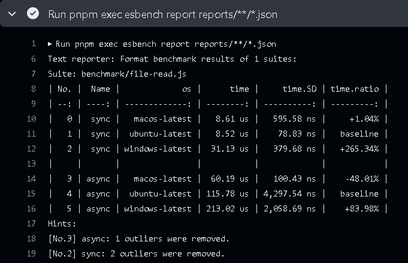

# Command Line Interface

## Commands

### esbench

Start ESBench in the current directory. 

Options:

| Options              |                                                                                                 |
|----------------------|-------------------------------------------------------------------------------------------------|
| `--config <file>`    | Use specified config file (string)                                                              |
| `--logLevel <level>` | info \| warn \| error \| off (string)                                                           |
| `--no-loader`        | Disable builtin TypeScript loader (boolean)                                                     |
| `--tag <name:value>` | Add variables to the results (string[])                                                         |
| `--file <path>`      | Run only suite that contains the value in their paths (string)                                  |
| `--name <regex>`     | Run benchmark with names matching the Regex pattern (string)                                    |
| `--builder <regex>`  | Run only suites built with the specified builder which name matching the Regex pattern (string) |
| `--executor <regex>` | Run benchmarks using only the executor which name matching the Regex pattern (string)           |
| `--shared <shared>`  | The test suite shard to execute in a format of `<index>/<count>` (string)                       |

```shell
# Run all suites
esbench

# Run case "For-index" in suite files that paths contains "array-sum.js`
esbench --file array-sum.js --name ^For-index$
```

### report

Generate report from result files that generated by [Raw Reporter](./reporters#raw-reporter)).

Options:

| Options           |                                             |
|-------------------|---------------------------------------------|
| `--config <file>` | Use specified config file (string)          |
| `--no-loader`     | Disable builtin TypeScript loader (boolean) |
| `<patterns...>`   | Glob patterns for files to load (string[])  |

```shell
# Combine results files into one report
esbench report reports/benchmark-*.json
```

## Advanced Usage

### Cross OS Benchmark

Although ESBench has a built-in toolchains and parameters as variables, this is not all factors in the performance of a function. External environments (such as OS and hardware) are not controlled by ESBench, but you can tag them with the `--tag` argument.

The GitHub Actions shows how to run benchmarks on different OS and merge the results into a single table:

[Repository on GitHub](https://github.com/ESBenchmark/ci-examples/tree/master)

::: code-group
```yaml [.github/workflows/cross-os.yml]
name: Cross OS Example

on: [push]

jobs:
  # First run the benchmarks in 3 operating systems.
  run:
    strategy:
      matrix:
        os: [macos-latest, windows-latest, ubuntu-latest]

    runs-on: ${{ matrix.os }}

    steps:
      # Initialize repository
      - uses: actions/checkout@v4
      - uses: actions/setup-node@v4
        with:
          node-version: latest
      - uses: pnpm/action-setup@v3
        with:
          version: latest
          run_install: true

      # Use --tag argument to add the OS name to result.
      - run: pnpm exec esbench --tag os:${{ matrix.os }}

      # Upload the result file to Actions Artifacts
      - uses: actions/upload-artifact@v4
        with:
          name: result-${{ matrix.os }}

          # This is the default path of Raw Reporter.
          path: node_modules/.esbench/result.json

  # Start a Job to generate the report.
  report:
    runs-on: ubuntu-latest

    # Should run after all the benchmarks finished.
    needs: run

    steps:
      # Initialize repository
      - uses: actions/checkout@v4
      - uses: actions/setup-node@v4
        with:
          node-version: latest
      - uses: pnpm/action-setup@v4
        with:
          version: latest
          run_install: true

      # Download result files from Actions Artifacts.
      # Filename is like:
      #   reports/result-${{ matrix.os }}/result.json
      - uses: actions/download-artifact@v4
        with:
          path: reports
          pattern: result-*

      # Use the report command to collect all results
      - run: pnpm exec esbench report reports/**/*.json
```
```javascript [file-read.js]
import { readFileSync } from "node:fs";
import { readFile } from "node:fs/promises";
import { defineSuite } from "esbench";

const filename = "pnpm-lock.yaml";

export default defineSuite({
	baseline: {
		type: "os",
		value: "ubuntu-latest"
	},
	setup(scene){
		scene.bench("sync", () => readFileSync(filename));
		scene.benchAsync("async", () => readFile(filename));
	}
});
```
:::



### Sharding

When you have a lot of suites, benchmarking can take very long time, and one way to speed things up is to use multiple machines to run them simultaneously.

By using `--shared` argument, ESBench splits suites into multiple different runs, for example `--shared 1/3`  split the suite into three shards, each running one third of the suites.

GitHub action example ([repository](https://github.com/ESBenchmark/ci-examples/tree/sharding)):

```yaml
name: Sharding Example

on: [push]

jobs:
  run:
    # Schedule 3 instances to run benchmark
    strategy:
      matrix:
        index: [1, 2, 3]
        total: [3]

    runs-on: ubuntu-latest

    steps:
      # Initialize repository
      - uses: actions/checkout@v4
      - uses: actions/setup-node@v4
        with:
          node-version: latest
      - uses: pnpm/action-setup@v3
        with:
          version: latest
          run_install: true

      # Use `--shared` to make ESBench run partial of suites.
      - run: pnpm exec esbench --shared ${{ matrix.index }}/${{ matrix.total }}

      # Upload the result file to Actions Artifacts
      - uses: actions/upload-artifact@v4
        with:
          name: result-${{ matrix.index }}.json

          # This is the default output path of Raw Reporter.
          path: node_modules/.esbench/result.json

  # Start a Job to generate the report.
  report:
    runs-on: ubuntu-latest

    # Should run after all the benchmarks finished.
    needs: run

    steps:
      # Initialize repository
      - uses: actions/checkout@v4
      - uses: actions/setup-node@v4
        with:
          node-version: latest
      - uses: pnpm/action-setup@v4
        with:
          version: latest
          run_install: true

      # Download result files from Actions Artifacts.
      # Filename is like:
      #   reports/result-${{ matrix.os }}/result.json
      - uses: actions/download-artifact@v4
        with:
          path: reports
          pattern: result-*

      # Use the report command to collect all results
      - run: pnpm exec esbench report reports/**/*.json
```

`--shared` works at the suite level, which means benchmark cases inside a suite cannot be split. If the number of use cases within the suite varies too much, they will be distributed unevenly, causing some instances to run longer than others.
