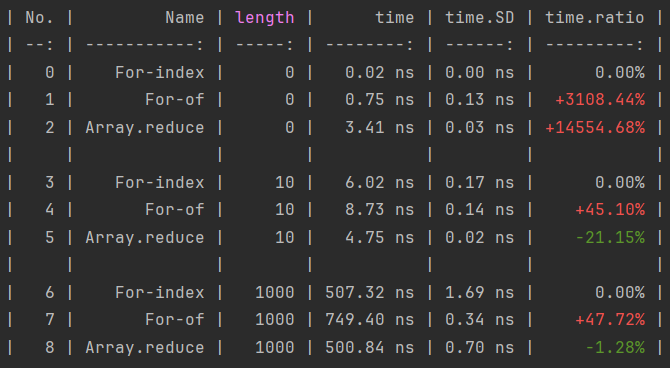
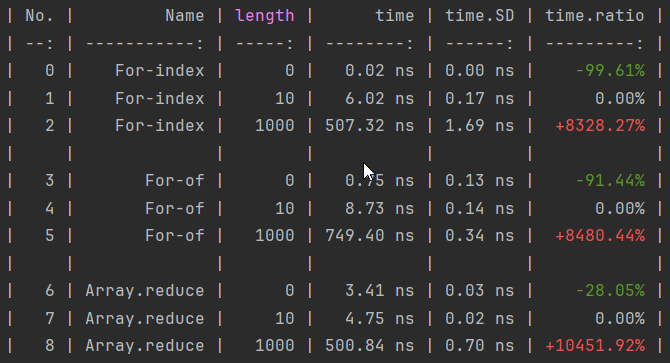
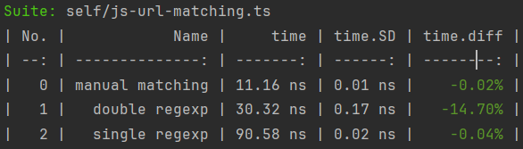

# Comparison

## Baseline

In order to scale your results, you can mark a [variable](./parameterization#variables) as a baseline.

```javascript
import { defineSuite } from "esbench";

export default defineSuite({
	params: {
		length: [0, 10, 1000],
	},
	baseline: {// [!code ++]
		type: "Name",// [!code ++]
		value: "For-index",// [!code ++]
	},// [!code ++]
	setup(scene) {
		const { length } = scene.params;
		const values = Array.from({ length }, (_, i) => i);

		scene.bench("For-index", () => {
			let sum = 0;
			for (let i = 0; i < length; i++) sum += values[i];
			return sum;
		});

		scene.bench("For-of", () => {
			let sum = 0;
			for (const v of values) sum += v;
			return sum;
		});

		scene.bench("Array.reduce", () => {
			return values.reduce((v, s) => s + v, 0);
		});
	},
});
```

If the baseline option is set, rows in the text report will be grouped and a new `*.ratio` column will be added to show the difference between the other use cases and the baseline case:



Change the baseline to `{ type: "length", value: 10 }` and the report will be:



## Previous Runs

ESBench can also compare the results with previous runs, by specify a result file generated by [rawReporter](./reporters#rawreporter).

```javascript
import { defineConfig, rawReporter, textReporter } from "esbench/host";

export default defineConfig({
	reporters: [
		// Save the results to reports/benchmark.json.
		rawReporter(),

		textReporter(),
	],
	// Specify a results file to compare with.
	diff: "reports/benchmark.json",
});
```

Run a suite twice, you'll see a `*.diff` column added to the table, showing the difference between the current result and the saved result.


