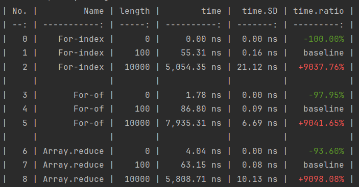

# Comparison

## Baseline

In order to scale your results, you can mark a [variable](./parameterization#variables) as a baseline.

```javascript
import { defineSuite } from "esbench";

export default defineSuite({
	params: {
		length: [0, 10, 1000],
	},
	baseline: {// [!code ++]
		type: "Name",// [!code ++]
		value: "For-index",// [!code ++]
	},// [!code ++]
	setup(scene) {
		const { length } = scene.params;
		const values = Array.from({ length }, (_, i) => i);

		scene.bench("For-index", () => {
			let sum = 0;
			for (let i = 0; i < length; i++) sum += values[i];
			return sum;
		});

		scene.bench("For-of", () => {
			let sum = 0;
			for (const v of values) sum += v;
			return sum;
		});

		scene.bench("Array.reduce", () => {
			return values.reduce((v, s) => s + v, 0);
		});
	},
});
```

If the baseline option is set, rows in the text report will be grouped and a new `*.ratio` column will be added to show the difference between the other use cases and the baseline case:


Change the baseline to `{ type: "length", value: 10 }` and the report will be:



## Previous Runs

ESBench can also compare the results with previous runs, This feature is enabled by default.

When execution is complete, `rawReporter` saves the raw result to a file. The next time it is run ESBench tries to read the file specified by the diff option, and if it exists passes it to reporters as the result of the previous run.

```javascript
import { defineConfig, rawReporter, textReporter } from "esbench/host";

// This is the detault value of `reporters` and `diff`.
export default defineConfig({
	reporters: [
		// Save the results to node_modules/.esbench/result.json.
		rawReporter("node_modules/.esbench/result.json"),
        
        // Show tables in console.
		textReporter(),
	],
	// Read a results file to compare with. 
    // Set it to null to disable comparation.
	diff: "node_modules/.esbench/result.json",
});
```

Run a suite twice, you'll see a `*.diff` column added to the table, showing the difference between the current result and the saved result.


The built-in `htmlReporter` also compares the differences, with the previous run plotted as a patterned bar.


