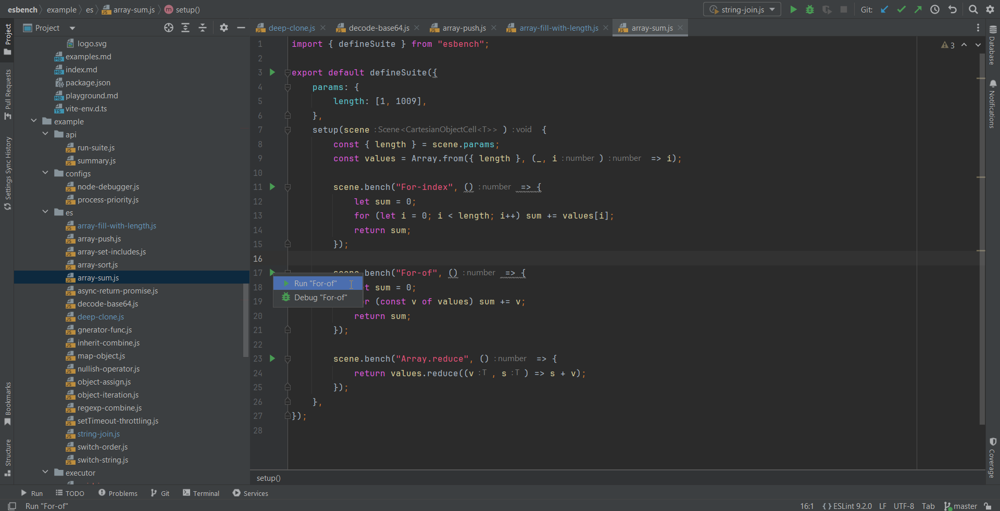
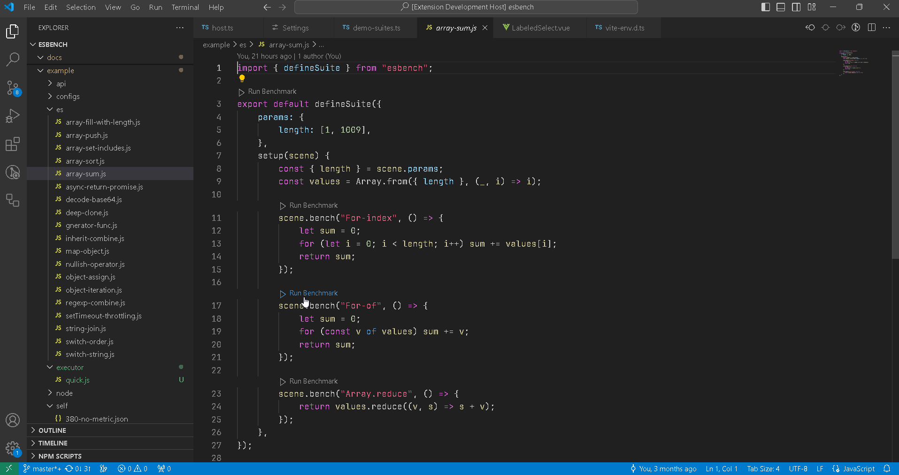

# IDE Integration

ESBench provide official IDE plugins that help you to run suites and cases with a click of the mouse.

## JetBrains IDE

[JetBrains Marketplace](https://plugins.jetbrains.com/plugin/24361-esbench)

## VSCode

[VSCode Marketplace](https://marketplace.visualstudio.com/items?itemName=Kaciras.esbench-vscode)

