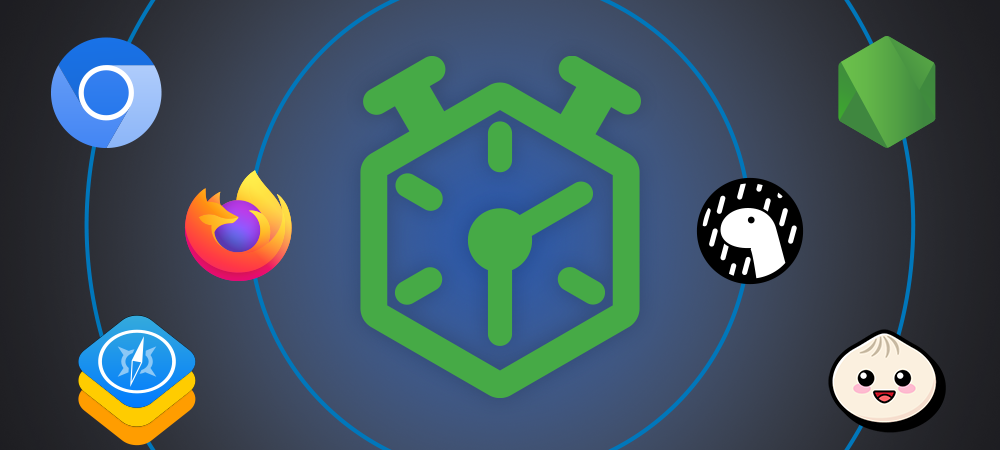
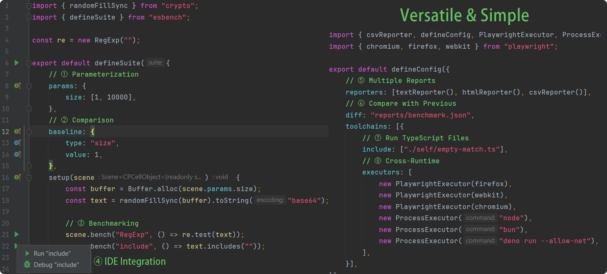
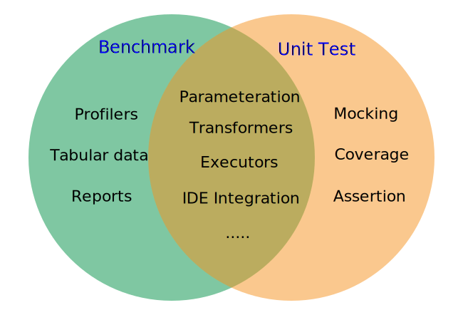

# Introduction

ESBench is a modern JavaScript benchmarking tool.

- **Cross-runtime**: run your benchmark on Node, Bun, browsers, remote devices and more...
- **Parameterization**: provide a series of parameters and see the performance of each combination.
- **Comparison**: support baselines and diff with previous runs.
- **TypeScript Out-of-box**: run your `.ts` files with zero config.
- **HTML Reporter**: plot the results into an interactive chart.
- **Extensible**: support custom profiler, executor, and reporter.
- **IDE Integration**: run specific suite or case with a click of the mouse, support WebStorm and VSCode.

## Why ESBench

### Cross Runtime

One difference between JavaScript and other languages is that it has no official interpreter. Browsers, Node, the new Deno, and bun are all possible target platforms, all of them use performance as a selling point and provide some examples of benchmarking. But real-world situations won't be the same as the examples, to find out how they perform on your own project, you'll always need to test them yourself.

**ESBench aims to run your benchmarks on various platforms** and let you know comprehensive and reliable results. help you choose the best environment for scaling your application.

### Benchmark without the hassle

ESBench includes a rich set of benchmarking features and integrates with popular tools that can be used with a simple declaration. ESBench hides the details of their implementation, allows you to write benchmarks in the simplest way - no harder than writing unit tests!

If that's not enough, ESBench also supports extensions - it's plug-in architecture.

### Lightweight

At only 202 KB (minified, including dependencies), ESBench is a thoroughly lightweight library.

## ESBench vs X

### Other Benchmark Tools

Before ESBench, there were already some benchmarking tools: [benchmark.js](https://github.com/bestiejs/benchmark.js), [tinybench](https://github.com/tinylibs/tinybench), [mitata](https://github.com/evanwashere/mitata), [isitfast](https://github.com/yamiteru/isitfast), [cronometro](https://github.com/ShogunPanda/cronometro), and more...

However, these tools are limited to in-process and do not support builders and running across runtimes, which is the main problem ESBench addresses.

Inspired by [BenchmarkDotNet](https://benchmarkdotnet.org/) and referencing existing tools, ESBench offers the most complete set of features.

### Vitest

[Vitest](https://vitest.dev) was originally created for unit testing, and later added benchmark support and the ability to run in the browser, has become a more general framework. It brings a consistent, out-of-the-box development experience to the Vite ecosystem.

ESBench and Vitest overlap in functionality, they both support the build process and run on multiple platforms, and ESBench also has [Validator](./validation) to do simple testing, but there are some differences.

* ESBench focuses on benchmarking, it doesn't have the complexity that comes with extra features and is much more powerful in its benchmarking.
* ESBench has a lean core and can easily support various toolchains via plugins, while Vitest is tied to Vite, meaning you need to opt for the Vite ecosystem.
