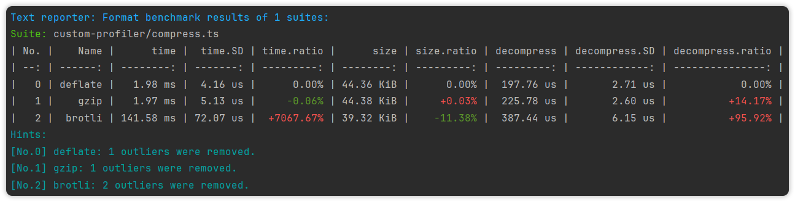
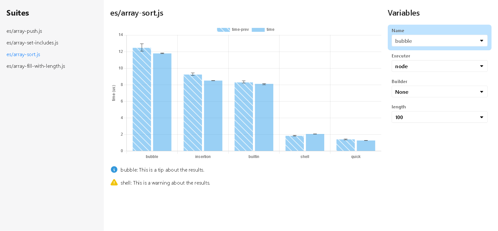

# Reporters

When all suites have been executed, the results are collected and processed by reporters.

```typescript
/**
 * A reporter allows you to export results of your benchmark in different formats.
 *
 * @param result The result of all suites.
 * @param context An object contains utility functions and informational bits.
 */
export type Reporter = (result: ESBenchResult, context: HostContext) => Awaitable<unknown>;
```

Set reporters in config:

```javascript
import { defineConfig, textReporter, csvReporter, rawReporter, htmlReporter } from "esbench/host";

export default defineConfig({
	reporters: [
		textReporter(),
		csvReporter(),
        rawReporter(),
        htmlReporter(),
        
        // Customize
		(result, context) => {/* ... */},
    ],
    // Default:
	// reporters: [textReporter()]
});
```

## Built-in Reporters

### Text Reporter

Format the results into Markdown tables with additional hints and output them to various streams.

```typescript
import { textReporter, defineConfig } from "esbench/host";

export default defineConfig({
	reporters: [
		// This is default applied.
		textReporter(),

		textReporter({
			// Write the report to a text file.
			file: "/path/to/report.txt",

			// Set to false to avoid print the report to console.
			console: false,
            
            // ...SummaryTableOptions (see ↓)
        }),
	],
});

interface SummaryTableOptions {
	/**
	 * Show standard deviation (*.SD) columns in the table.
	 *
	 * @default true
	 *
	 * @example
	 * textReporter({ stdDev: true })
	 * | No. |      Name |    time | time.SD |
	 * | --: | --------: | ------: | ------: |
	 * |   0 | For-index | 0.37 ns | 0.01 ns |
	 * |   1 |    For-of | 6.26 ns | 2.88 ns |
	 */
	stdDev?: boolean;

	/**
	 * By default, variables with only one value are omitted from the table.
	 * Set to true to show all variables.
	 *
	 * @default false
	 */
	showSingle?: boolean;

	/**
	 * Show percentile columns in the table.
	 *
	 * @example
	 * textReporter({ percentiles: [75, 99] })
	 * | No. |   name |      time |  time.p75 | time.p99 |
	 * | --: | -----: | --------: | --------: | -------: |
	 * |   0 | object | 938.45 ms | 992.03 ms |   1.08 s |
	 * |   1 |    map |    1.03 s |    1.07 s |    1.1 s |
	 */
	percentiles?: number[];

	/**
	 * Specifies which outliers should be removed from the distribution.
	 *
	 * @default "all"
	 */
	outliers?: false | "worst" | "best" | "all";

	/**
	 * Using ratioStyle, we can override the style of the diff and the baseline column.
	 *
	 * @example
	 *            "percentage"      "trend"       "value"
	 *    time   | time.ratio | | time.ratio | | time.ratio |
	 * 117.26 us |      0.00% | |    100.00% | |      1.00x | (baseline)
	 * 274.14 us |   +133.79% | |    233.79% | |      2.34x |
	 *  19.82 us |    -83.10% | |     16.90% | |      0.17x |
	 *
	 * @default "percentage“
	 */
	ratioStyle?: RatioStyle;
}
```

Output example:



### Raw Reporter

Save the results to a JSON file without format The file can be read by `esbench report` and used for `diff` option in config.

### CSV Reporter

Export the results to CSV files. Files are saved in the specified directory with the path of the suite filename + `.csv`.

```javascript
import { csvReporter, defineConfig } from "esbench/host";

export default defineConfig({
	reporters: [
		// Save as CSV files in reports/
		csvReporter(),

		csvReporter({
            directory: "/folder/to/save/files",
            // ...SummaryTableOptions (see Text Reporter)
        }),
	],
});
```

### HTML Reporter

Plot the results in interactive chart. It is also available in playground.

```javascript
import { defineConfig, htmlReporter } from "esbench/host";

export default defineConfig({
	reporters: [
		// Save the HTML report to reports/benchmark.html
		htmlReporter(),
        
        // Specify the file path.
		htmlReporter("/path/to/save.html"),
	],
});
```

The page looks like:



- The left is the benchmark suite menu.
- Middle top is the chart, X-axis is the current variables, Y-axis is metrics. If there are multiple metrics for a case, each will be displayed in different color, and the previous value will be patterned.
- Middle bottom contains additional information.
- On the right are the filters, each variable of the suite has a select box and the highlighted item (click the label to switch) will be used as the X-axis.
