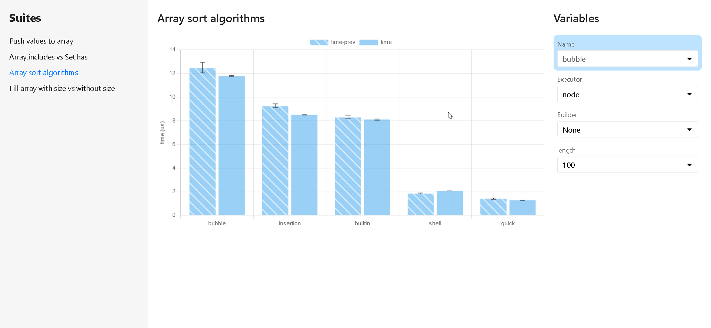

# Reporters

When all suites have been executed, the results are collected and processed by reporters.

```typescript
/**
 * A reporter allows you to export results of your benchmark in different formats.
 *
 * @param result The result of all suites.
 * @param prev Another result used to calculate difference.
 */
type Reporter = (result: ESBenchResult, prev?: ESBenchResult) => Awaitable<unknown>;
```

Set reporters in config:

```javascript
import { defineConfig, textReporter, csvReporter, rawReporter, htmlReporter } from "esbench/host";

export default defineConfig({
	reporters: [
		textReporter(),
		csvReporter(),
        rawReporter(),
        htmlReporter(),
        
        // Customize
		(result, prev) => {/* ... */},
    ],
    // Default:
	// reporters: [textReporter()]
});
```

## Builtin Reporters

### textReporter

Format the results into text and output to various streams.

### rawReporter

Save the results to a JSON file without format.

Files can be read by `esbench report` and used for `diff` option in config.

### csvReporter

Export the results to CSV files.

Files are saved in the specified directory (default "reports") with the path of the suite filename + `.csv`.

### htmlReporter

Plot the results in interactive charts.


