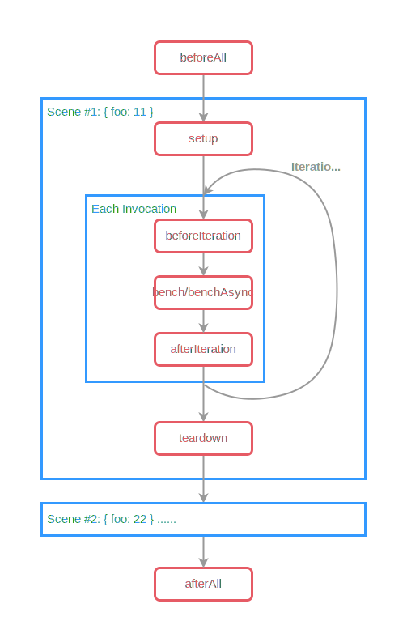

# Setup And Cleanup

Sometimes we want to write some logic which should be executed before or after a benchmark, but we don't want to measure it.

```javascript
export default defineSuite({
	name: "Array sort algorithms",
	params: {
		length: [10, 10000],
	},
	setup(scene) {
		const { length } = scene.params;

		// Generate numbers to sort.
		const template = Array.from({ length }, () => Math.random());
		let array = [];
		
		// Time of sort depends on the elements order, 
        // so we must reset the array before.
		scene.beforeIteration(() => array = template.slice());
		
		scene.bench("builtin", () => array.sort((a, b) => a - b));
	},
});
```

> [!WARNING]
> It's not recommended to use `beforeIteration` & `afterIteration` in microbenchmarks because it can spoil the results.

ESBench provides a set of lifecycle hooks for suites:

```javascript
import { defineSuite } from "esbench";

export default defineSuite({
	name: "Suite Name",
    params: {
		foo: [11, 22],
    },
	beforeAll() {
		// Run once before executing the suite...
	},
	afterAll() {
		// Run once after finishing...
	},
	setup(scene) {
		// Setup for each scene...
		
		scene.beforeIteration(() => {
			// Run before each benchmark invocation...
		});
		scene.afterIteration(() => {
			// Run after each benchmark invocation...
		});

		scene.afterEach(() => {
			// Cleanup on all cases of the scene executed...
		});
	},
});
```


