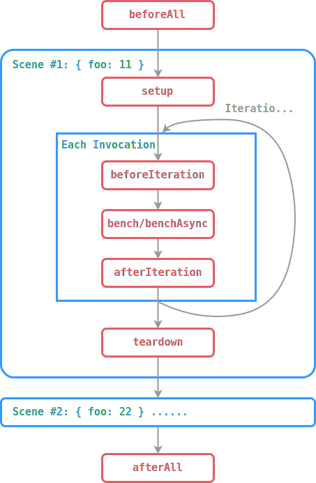

# Suites


## Define Suite

The simplest way to define a suite is export a function, and add benchmark cases using `Scene.bench()` and `Scene.benchAsync()`.

```javascript
export default scene => {
	const values = Array.from({ length: 1000 }, (_, i) => i);
	
	scene.bench("Array.reduce", () => values.reduce((v, s) => s + v));
	
	// For async workloads.
	scene.benchAsync("fetch", () => fetch("https://example.com"));
};
```

You can use the `defineSuite` helper to leverage your IDE's intellisense. [IDE plugins](./ide-integration) also require it to find benchmark cases.

```javascript
import { defineSuite } from "esbench";

export default defineSuite(scene => {
	// ...
});
```

The function-style suite is a shorthand for:

```javascript
import { defineSuite } from "esbench";

export default defineSuite({
	// Options...
	setup(scene) {
		// ...
    },
});
```

Options:

* `params`: Benchmark cases under different inputs, see [Parameterization](./parameterization).
* `baseline`: Scale your results, see [Baselines](./comparison).
* `profilers`: Add more profilers for the suite. see [Custom Profilers](../api/profiler).
* `timing`: Configure execution time mensuration, see [Time Profiler](./time-profiler).
* `validate`: Perform checks for cases before they are executed, see [Validation](./validation)
* `beforeAll`: Runs a function before running the suite, see [Lifecycle Hooks](./suites#lifecycle-hooks).
* `afterAll`: Runs a function after the suite has finished running, see [Lifecycle Hooks](./suites#lifecycle-hooks).

## Conditional

The `setup` function can be asynchronous, in addition `scene.bench` can be called within a conditional block, so you can add benchmark cases based on the context.

```javascript
// Deep clone an object with serialization and deserialization.
export default defineSuite(async scene => {
	const data = {/* ... */};
	scene.bench("JSON", () => JSON.parse(JSON.stringify(data)));
	
	if (globalThis.structuredClone) {
		scene.bench("structuredClone", () => structuredClone(data));
    }

	try {
		const { serialize, deserialize } = await import("v8");
		scene.bench("v8 serialize", () => deserialize(serialize(data)));
	} catch {
		// Not executed in Node, skip this case.
	}
});
```

## Lifecycle Hooks

Sometimes we want to write some logic which should be executed before or after a benchmark, but we don't want to measure it.

```javascript
export default defineSuite({
	setup(scene) {
		// Generate numbers to sort.
		const template = Array.from({ length: 1000 }, () => Math.random());
		let array = [];
		
		// Time of sort depends on the elements order, 
        // so we must reset the array before each run.
		scene.beforeIteration(() => array = template.slice());
		
		scene.bench("builtin", () => array.sort((a, b) => a - b));
	},
});
```

> [!WARNING]
> It's not recommended to use `beforeIteration` & `afterIteration` in microbenchmarks because it can spoil the results.

ESBench provides a set of lifecycle hooks for suites. If a hook function returns a promise, ESBench waits until the promise resolve before running the benchmark case.

```javascript
import { defineSuite } from "esbench";

export default defineSuite({
    params: {
		foo: [11, 22],
    },
	beforeAll() {
		// Run once before executing the suite...
	},
	afterAll() {
		// Run once after finishing...
	},
	setup(scene) {
		// Setup for each scene...
		
		scene.beforeIteration(() => {
			// Run before each benchmark invocation...
		});
		scene.afterIteration(() => {
			// Run after each benchmark invocation...
		});

		scene.teardown(() => {
			// Cleanup on all cases of the scene executed...
		});
	},
});
```


