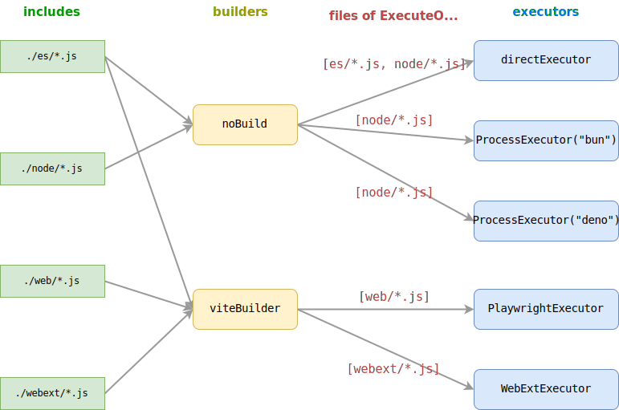

# Toolchains

ESBench is a cross runtime benchmark tool, which means you can run your suite on different runtimes.

## Run In Browsers

Following example runs the suite on Firefox, Webkit, and Chromium using [Playwright](https://playwright.dev).

First install playwright and a builder (Vite). 

```shell
pnpm add -D playwright vite
```

> [!INFO]
> The builder is needed because browser and Node have a different import resolving algorithm, and ESBench does not handle that, so suites need to be built to transform imports.

Then add builder & executors to config:

::: code-group
```javascript [esbench.config.js]
import { defineConfig, PlaywrightExecutor, ViteBuilder } from "esbench/host";
import { chromium, firefox, webkit } from "playwright";

export default defineConfig({
	toolchains: [{
		builders: [new ViteBuilder()],
		executors: [
			new PlaywrightExecutor(firefox, { headless: false }),
			new PlaywrightExecutor(webkit, { headless: false }),
			new PlaywrightExecutor(chromium, { headless: false }),
		],
	}],
});
```
```javascript [benchmark/array-sum.js]
import { defineSuite } from "esbench";

export default defineSuite(scene => {
	const length = 1000;
	const values = Array.from({ length }, (_, i) => i);

	scene.bench("For-index", () => {
		let sum = 0;
		for (let i = 0; i < length; i++) sum += values[i];
		return sum;
	});

	scene.bench("For-of", () => {
		let sum = 0;
		for (const v of values) sum += v;
		return sum;
	});

	scene.bench("Array.reduce", () => {
		return values.reduce((v, s) => s + v, 0);
	});
});
```
:::

Run `esbench` pop up the browser window 3 times, and the suite is executed on a blank page. Remove `headless: false` from the config makes browsers run in background.

The results reveal the performance differences between browsers:

```text
| No. |         Name | Executor |        time |  time.SD |
| --: | -----------: | -------: | ----------: | -------: |
|   0 |    For-index |  firefox |   571.34 ns |  9.94 ns |
|   1 |       For-of |  firefox | 5,594.56 ns | 16.03 ns |
|   2 | Array.reduce |  firefox | 4,176.23 ns | 66.07 ns |
|   3 |    For-index |   webkit | 1,085.04 ns |  7.32 ns |
|   4 |       For-of |   webkit | 2,744.84 ns | 30.12 ns |
|   5 | Array.reduce |   webkit | 2,565.46 ns | 30.58 ns |
|   6 |    For-index | chromium |   533.09 ns |  2.71 ns |
|   7 |       For-of | chromium |   542.60 ns |  6.00 ns |
|   8 | Array.reduce | chromium |   367.89 ns |  0.67 ns |
```

## Builtin Tools

ESBench provide some builders and executors out of box.

Builder:

* `noBuild` (default) Does not perform any transformation, executors will import source files.
* `ViteBuilder` Build suites with [Vite](https://vitejs.dev), requires Vite installed.
* `RollupBuilder` Build suites with [Rollup](https://rollupjs.org/), requires Rollup installed.

Executor:

* `inProcessExecutor` (default) Run suites directly in the current context.
* `ProcessExecutor` Call an external JS runtime to run suites, the runtime must support the fetch API.
* `NodeExecutor` Spawn a new Node process to run suites, can be used with legacy Node that does not have `fetch`.
* `PlaywrightExecutor` Run suites in the browser.
* `WebextExecutor` Run suites in the browser with [WebExtension API](https://developer.chrome.com/docs/extensions/reference/api) access, only support Chromium.

## Multiple Toolchains

When part of the suite needs to run in a different environment, you can add multiple toolchains.

* A builder will build all files match the `include` in toolchain item that contains it.
* An executor will execute matched files of each build which the builder in the same toolchain item.

A complex example:

```javascript
import { defineConfig, PlaywrightExecutor, ProcessExecutor, ViteBuilder, WebextExecutor } from "esbench/host";
import { chromium } from "playwright";

const viteBuilder = new ViteBuilder();

export default defineConfig({
	toolchains: [
		{
			include: ["./es/*.js", "./node/*.js"],
		},
		{
			include: ["./es/*.js", "./web/*.js"],
			builders: [viteBuilder],
			executors: [new PlaywrightExecutor(chromium)],
		},
		{
			include: ["./webext/*.js"],
			builders: [viteBuilder],
			executors: [new WebextExecutor(chromium)],
		},
		{
			include: ["./node/*.js"],
			executors: [
				new ProcessExecutor("bun"),
				new ProcessExecutor("deno run --allow-net"),
			],
		},
	],
});
```



## Tool Names

Each tool must have a unique name (a builder and an executor can have the same name).

```javascript
import { defineConfig, ViteBuilder } from "esbench/host";

export default defineConfig({
	toolchains: [{
        // Error: Each tool must have a unique name: Vite
		builders: [
			new ViteBuilder({ output: { format: "es" } }),
			new ViteBuilder({ output: { format: "cjs" } }),
		],
	}],
});
```

To fix this, you can give builders names:

```javascript
import { defineConfig, ViteBuilder } from "esbench/host";

export default defineConfig({
	toolchains: [{
		builders: [{
			name: "ESM",
            use: new ViteBuilder({ output: { format: "es" } }),
        },{
			name: "CJS",
            use: new ViteBuilder({ output: { format: "cjs" } }),
        }],
	}],
});
```
