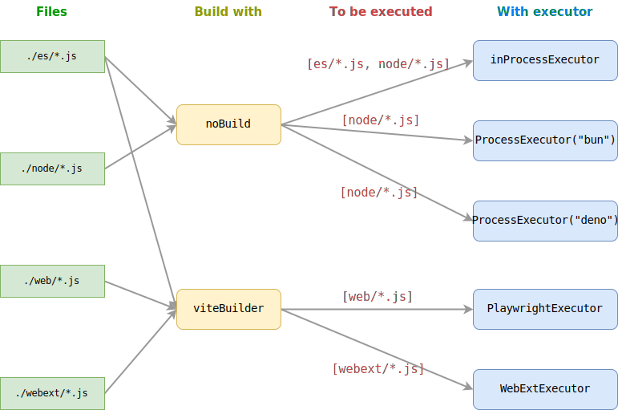

# Toolchains

ESBench is a cross runtime benchmark tool, which means you can run your suite on different runtimes.

Benefit from the plug-in architecture, ESBench supports customize how to run the code via Builder and Executor.

## Run In Browsers

Following example runs the suite on Firefox, Webkit, and Chromium using [Playwright](https://playwright.dev).

First install playwright:

```shell
pnpm add -D playwright
```

Then add executors to config:

::: code-group
```javascript [esbench.config.js]
import { defineConfig, PlaywrightExecutor } from "esbench/host";
import { chromium, firefox, webkit } from "playwright";

export default defineConfig({
	toolchains: [{
		executors: [
			new PlaywrightExecutor(firefox, { headless: false }),
			new PlaywrightExecutor(webkit, { headless: false }),
			new PlaywrightExecutor(chromium, { headless: false }),
		],
	}],
});
```
```javascript [benchmark/array-sum.js]
import { defineSuite } from "esbench";

export default defineSuite(scene => {
	const length = 1000;
	const values = Array.from({ length }, (_, i) => i);

	scene.bench("For-index", () => {
		let sum = 0;
		for (let i = 0; i < length; i++) sum += values[i];
		return sum;
	});

	scene.bench("For-of", () => {
		let sum = 0;
		for (const v of values) sum += v;
		return sum;
	});

	scene.bench("Array.reduce", () => {
		return values.reduce((v, s) => s + v, 0);
	});
});
```
:::

Because of browser and Node have a different module resolving algorithm, imports must be resolved before sending the code to the browser, there are two ways to do this:

* Add flag `--experimental-import-meta-resolve` to enable [builtin transformer](#built-in-transformer).
* Use a builder, see [Builder](./toolchains#builder).

::: code-group
```shell [Windows]
set NODE_OPTIONS=--experimental-import-meta-resolve && esbench
```
```shell [Linux]
NODE_OPTIONS=--experimental-import-meta-resolve && esbench
```
:::

During execution, the browser pops up window 3 times, and the suite is executed on a blank page. Remove `headless: false` from the config makes browsers run in background.

The results reveal the performance differences between browsers:

```text
| No. |         Name | Executor |        time |  time.SD |
| --: | -----------: | -------: | ----------: | -------: |
|   0 |    For-index |  firefox |   571.34 ns |  9.94 ns |
|   1 |       For-of |  firefox | 5,594.56 ns | 16.03 ns |
|   2 | Array.reduce |  firefox | 4,176.23 ns | 66.07 ns |
|   3 |    For-index |   webkit | 1,085.04 ns |  7.32 ns |
|   4 |       For-of |   webkit | 2,744.84 ns | 30.12 ns |
|   5 | Array.reduce |   webkit | 2,565.46 ns | 30.58 ns |
|   6 |    For-index | chromium |   533.09 ns |  2.71 ns |
|   7 |       For-of | chromium |   542.60 ns |  6.00 ns |
|   8 | Array.reduce | chromium |   367.89 ns |  0.67 ns |
```

Playwright launches its own browser by default, they are not equivalent to the released version. You can specify the path to the browser via `executablePath`, but this may fail to launch. 

Another way is to use [WebRemoteExecutor](#webremoteexecutor), which supports any browser.

```javascript
new PlaywrightExecutor(chromium, {
	executablePath: "C:/Program Files (x86)/Microsoft/Edge/Application/msedge.exe",
});
```

ESBench has some [Built-in executors](./toolchains#built-in-executors) to help you run benchmarks in a variety of environments.

## Built-in Transformer

To make browsers run the suite without install extra dependencies, ESBench provides a simple transformer that can:

- Resolve imports to absolute path, so that they can be used in browser.
- Compile TypeScript files to JavaScript.

The transformer uses `import.meta.resolve` to resolve modules, it is currently an experimental feature, you need a flag `--experimental-import-meta-resolve` to enable it.

Limitations:

- The transformer does not support source maps, locations in stack of error from transformed files may be incorrect.
- Import transformation is only works for string literals, `import(someVar)` will be skipped.
- Importing assets (e.g. `import "style.css"`) is outside of the scope for ESBench, which needs a builder.

## Builder

ESBench allows you to add a build step for suites, it is useful when:

* The code must be built before it can be run, e.g. contains `import "style.css"`.
* The platform does not support Node resolving.

```javascript
import { defineConfig, ViteBuilder, PlaywrightExecutor } from "esbench/host";
import { chromium } from "playwright";

export default defineConfig({
	toolchains: [{
		// Build suites with Vite, requires `vite` package installed.
		builders: [new ViteBuilder()],
        
        // Will run build output of ViteBuilder, not the source files.
		executors: [new PlaywrightExecutor(chromium)],
	}],
});
```

Then you can just run `esbench` without flags, as imports are already transformed by the builder. 

**Builders are not just allow browsers to run code, they also can be the target for benchmarking.** One scenario is when you want to know how build configurations affect the performance of the output code:

::: code-group
```javascript [esbench.config.js]
import { defineConfig, ViteBuilder } from "esbench/host";

// Compare native `for await` and esbuild's polyfill code.
export default defineConfig({
	toolchains: [{
		builders: [
			{
				name: "modern",
				use: new ViteBuilder({ build: { target: "esnext" } }),
			},
			{
				name: "transpile",
				use: new ViteBuilder({ build: { target: "es6" } }),
			},
		],
	}],
});
```
```javascript [transpile.js]
import { defineSuite } from "esbench";

const consume = () => {};

export default defineSuite(scene => {
	const values = Array.from({ length: 100 }, (_, i) => i);

	scene.benchAsync("async iter", async () => {
		for await (const v of values) consume(v);
	});
});
```
:::

As expected, the translated code is slower than the native:

```text
| No. |   Builder |     time |  time.SD |
| --: | --------: | -------: | -------: |
|   0 |    modern |  9.47 us | 14.13 ns |
|   1 | transpile | 14.34 us | 88.22 ns |
```

For more built-in builders, see [built-in builders](./toolchains#built-in-builders).

## Multiple Toolchains

When part of the suite needs to run in a different environment, you can add multiple toolchains.

* A builder will build all files match the `include` in toolchain item that contains it.
* An executor will execute matched files of each build which the builder in the same toolchain item.

A complex example:

```javascript
import { defineConfig, PlaywrightExecutor, ProcessExecutor, ViteBuilder, WebextExecutor } from "esbench/host";
import { chromium } from "playwright";

const viteBuilder = new ViteBuilder();

export default defineConfig({
	toolchains: [
		{
			include: ["./es/*.js", "./node/*.js"],
            
            // Default builders:
			// builders: [noBuild],
            
            // Default executors:
			// executors: [inProcessExecutor],
		},
		{
			include: ["./es/*.js", "./web/*.js"],
			builders: [viteBuilder],
			executors: [new PlaywrightExecutor(chromium)],
		},
		{
			include: ["./webext/*.js"],
			builders: [viteBuilder],
			executors: [new WebextExecutor(chromium)],
		},
		{
			include: ["./node/*.js"],
			executors: [
				new ProcessExecutor("bun"),
				new ProcessExecutor("deno run -A"),
			],
		},
	],
});
```



## Tool Names

Each tool must have a unique name (a builder and an executor can have the same name).

```javascript
import { defineConfig, ViteBuilder } from "esbench/host";

export default defineConfig({
	toolchains: [{
        // Error: Each tool must have a unique name: Vite
		builders: [
			new ViteBuilder({ output: { format: "es" } }),
			new ViteBuilder({ output: { format: "cjs" } }),
		],
	}],
});
```

To fix this, you can give builders names:

```javascript
import { defineConfig, ViteBuilder } from "esbench/host";

export default defineConfig({
	toolchains: [{
		builders: [{
			name: "ESM",
            use: new ViteBuilder({ output: { format: "es" } }),
        },{
			name: "CJS",
            use: new ViteBuilder({ output: { format: "cjs" } }),
        }],
	}],
});
```

## Built-in Builders

### noBuild

Does not perform any transformation, executors will import source files.

This is the default value of `builders` in `toolchains`.

```javascript
import { defineConfig, noBuild } from "esbench/host";

export default defineConfig({
	toolchains: [{
		builders: [noBuild], // This is the default.
	}],
});
```

### ViteBuilder

Build suites with [Vite](https://vitejs.dev), requires `vite` installed.

By default, it builds suites in library mode, you can also provide a custom config.

These options will be overridden:
- `build.outDir`
- `build.rollupOptions.preserveEntrySignatures`
- `build.rollupOptions.input`
- `build.rollupOptions.output.entryFileNames`

`ViteBuilder` does not automatically resolve config from project root.

```javascript
import { defineConfig, ViteBuilder } from "esbench/host";

export default defineConfig({
	toolchains: [
		// Use the default config.
		new ViteBuilder(),
        
        // Use a custom config
		// new ViteBuilder({ ... }),
    ],
});
```

### RollupBuilder

Build suites with [Rollup](https://rollupjs.org/), you have to install `rollup` and add plugins to perform Node resolving.

These options will be overridden:
- `input`
- `preserveEntrySignatures`

```javascript
import { defineConfig, RollupBuilder } from "esbench/host";

export default defineConfig({
	toolchains: [
		new RollupBuilder(/* config */),
    ],
});
```

## Built-in Executors

### inProcessExecutor

Run suites directly in the current process, useful for simple scenarios and debugging.

If the toolchain item does not specify `executors`, it equals to `executors: [inProcessExecutor]`

```javascript
import { inProcessExecutor } from "esbench";

export default defineConfig({
	toolchains: [{
		// ...
		executors: [inProcessExecutor],
	}],
});
```

### ProcessExecutor

Call an external JS runtime to run suites, the runtime must support the fetch API.

You can pass a string as argument to `ProcessExecutor`, the entry file will append to the end, or specific a function accept the entry filename and return the command.

```javascript
import { ProcessExecutor } from "esbench";

export default defineConfig({
	toolchains: [{
		executors: [
			// Benchmarking in Node, Bun and Deno. You need to install them before.
			new ProcessExecutor("node"),
			new ProcessExecutor("bun"),
			new ProcessExecutor("deno run --allow-net"),

            // Pass arguments after the entry.
			new ProcessExecutor(file => `node ${file} --foo`),

            // Set environment variables at the 2nd parameter.
			new ProcessExecutor("node", { NODE_ENV: "production" }),
		],
	}],
});
```

### NodeExecutor

Spawn a new Node process to run suites, can be used with legacy Node that does not have `fetch`.

```javascript
import { NodeExecutor } from "esbench";

export default defineConfig({
	toolchains: [{
		executors: [
			new NodeExecutor(),
            
            // Supported options
			new NodeExecutor({
                execPath: "/path/to/node",
				execArgv: ["--expose_gc"],
				env: { NODE_ENV: "production" },
            }),
		],
	}],
});
```

### PlaywrightExecutor

Run suites in the browser, requires Playwright installed. See [Run In browsers](./toolchains#run-in-browsers) for full example.

```javascript
import { PlaywrightExecutor } from "esbench";
import { firefox } from "playwright";

// import { firefox } from "playwright-core";
// import { firefox } from "@playwright/test";

export default defineConfig({
	toolchains: [{
		executors: [
			// Use the Firefox installed by Playwright.
			new PlaywrightExecutor(firefox),

            // Specify options.
			new PlaywrightExecutor(firefox, {
				executablePath: "/path/to/firefox"
            }),
		],
	}],
});
```

### WebextExecutor

Like `PlaywrightExecutor`, but run suites with [WebExtension API](https://developer.chrome.com/docs/extensions/reference/api) access, only support Chromium.

::: code-group
```javascript [esbench.config.js]
import { defineConfig, ViteBuilder, WebextExecutor } from "esbench";
import { chromium } from "playwright";

export default defineConfig({
	toolchains: [{
		include: ["./webext/*.js"],
		builders: [new ViteBuilder()],
		executors: [new WebextExecutor(chromium)],
	}],
});
```
```javascript [webext/storage.js]
// https://github.com/ESBenchmark/ESBench/blob/master/example/webext/storage.js
import { defineSuite } from "esbench";
import packageJson from "../package.json" with { type: "json" };

if (globalThis.browser === undefined) {
	globalThis.browser = chrome;
}

export default defineSuite(async scene => {
	// Read object.
	// localStorage vs CacheStorage vs browser.storage.local
	localStorage.setItem("foo", JSON.stringify(packageJson));
	await browser.storage.local.set(packageJson);
	const cs = await caches.open("test");
	await cs.put("https://example.com", new Response(JSON.stringify(packageJson)));

	scene.bench("localStorage", () => {
		return JSON.parse(localStorage.getItem("foo"));
	});

	scene.benchAsync("browser.storage", () => {
		return browser.storage.local.get();
	});

	scene.benchAsync("CacheStorage", async () => {
		return (await cs.match("https://example.com")).json();
	});
});
```
```shell [Run Benchmark]
esbench --file webext/storage.js
```
:::

### WebRemoteExecutor

`WebRemoteExecutor` is designed to run benchmark on any browser, it serves the suites on a HTTP URL, and you can access the URL to run them.

Once the page is open, it keeps pulling suites and executing them, so that you don't need to open the URL again the next time you run `esbench`.

```javascript
import { defineConfig, WebRemoteExecutor } from "esbench";

export default defineConfig({
	toolchains: [{
		executors: [
			// Default listening on http://localhost:14715
			// new WebRemoteExecutor(),

            // Specify host & port to allow network connection.
            // Assume the device is on 192.168.0.14
			new WebRemoteExecutor({ 
                host: "192.168.0.14", 
                port: 80,
                // Options of `https.createServer` is supported...
                // if `key` exists, it will create a HTTPS server.
			}),
        ],
	}],
});
```

Run ESBench, since suites will run in browser, the builtin transformer or a builder is required. See [run in browsers](./toolchains#run-in-browsers) for more details.

::: code-group
```shell [Windows]
set NODE_OPTIONS=--experimental-import-meta-resolve && esbench
```
```shell [Linux]
NODE_OPTIONS=--experimental-import-meta-resolve && esbench
```
:::

When started, it will print the message on console:

```text
...
[WebRemoteExecutor] Waiting for connection to: http://192.168.0.14:80
...
```

Open a browser on a remote device, such as a mobile phone, to access the URL, and ESBench will measure performance in that environment!

If you want ESBench open the page automatically, and close it after finished, you can set the `open` options.

```javascript
new WebRemoteExecutor({ open: {/* options */} })
```
